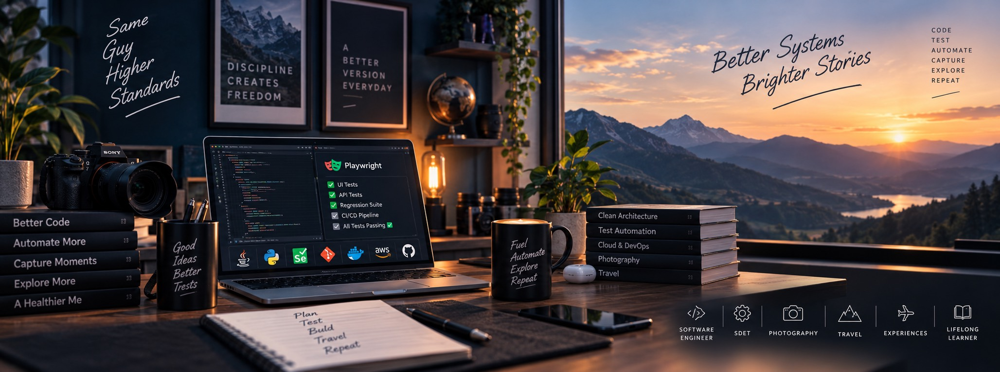

<!-- ═══════════════════════════════════════════════════════════════════════════════ -->
<!-- 🌌 NEURAL DEVELOPER DASHBOARD — LAVENDRA KUMAR RAJPUT                       -->
<!-- ═══════════════════════════════════════════════════════════════════════════════ -->

<div align="center">


<!-- ─────────────── HERO BANNER ─────────────── -->



<br/>

<!-- ─────────────── TYPING ANIMATION ─────────────── -->

<a href="https://git.io/typing-svg">
  
</a>

<br/>

<!-- ─────────────── PROFILE METRICS ─────────────── -->

<a href="https://github.com/lkumarra">
  
</a>
<a href="https://github.com/lkumarra?tab=repositories">
  
</a>


<br/><br/>

<!-- ─────────────── SOCIAL LINKS ─────────────── -->

<a href="https://linkedin.com/in/lavendra-kumar-rajput-112ab2106">
  
</a>
<a href="https://lkumarra.github.io">
  
</a>
<a href="mailto:lavendra.rajputc1@gmail.com">
  
</a>
<a href="https://twitter.com/lkumarra">
  
</a>

</div>

<!-- ═══════════════════════════════════════════════════════════════════════════════ -->


<!-- ═══════════════════════════════════════════════════════════════════════════════ -->
<!-- 📊 SECTION: COMMAND CENTER                                                    -->
<!-- ═══════════════════════════════════════════════════════════════════════════════ -->

<div align="center">

<br/>


<br/><br/>

<!-- Row 1: GitHub Stats + Streak -->
<a href="https://github.com/lkumarra">
  
</a>
<a href="https://github.com/lkumarra">
  
</a>

<br/><br/>

<!-- Row 2: Top Languages + Profile Summary -->
<a href="https://github.com/lkumarra">
  
</a>
<a href="https://github.com/lkumarra">
  
</a>

<br/><br/>

<!-- Row 3: Summary Cards Grid -->


<br/><br/>

<!-- Activity Graph -->
<a href="https://github.com/lkumarra">
  
</a>

</div>


<!-- ═══════════════════════════════════════════════════════════════════════════════ -->
<!-- 🛠️ SECTION: TECH STACK                                                        -->
<!-- ═══════════════════════════════════════════════════════════════════════════════ -->

<div align="center">

<br/>


<br/><br/>

<a href="https://skillicons.dev">
  
</a>

<br/><br/>

<a href="https://skillicons.dev">
  
</a>

<br/><br/>

<a href="https://skillicons.dev">
  
</a>

<br/><br/>

<details>
<summary><b>▸ Backend & Languages</b></summary>
<br/>


</details>

<details>
<summary><b>▸ Automation & Testing</b></summary>
<br/>


</details>

<details>
<summary><b>▸ DevOps & Cloud</b></summary>
<br/>


</details>

<details>
<summary><b>▸ Databases & Messaging</b></summary>
<br/>


</details>

<details>
<summary><b>▸ Tools & Monitoring</b></summary>
<br/>


</details>

</div>


<!-- ═══════════════════════════════════════════════════════════════════════════════ -->
<!-- 🎯 SECTION: AUTOMATION EXPERTISE                                              -->
<!-- ═══════════════════════════════════════════════════════════════════════════════ -->

<div align="center">

<br/>


<br/><br/>

<table>
<tr>
<td align="center" width="50%">

<br/>


<br/><br/>

<br/><br/>

<br/><br/>


<br/><br/>

</td>
<td align="center" width="50%">

<br/>


<br/><br/>

<br/><br/>

<br/><br/>


<br/><br/>

</td>
</tr>
</table>

</div>


<!-- ═══════════════════════════════════════════════════════════════════════════════ -->
<!-- 🤖 SECTION: AI & PLATFORM EXPERIENCE                                          -->
<!-- ═══════════════════════════════════════════════════════════════════════════════ -->

<div align="center">

<br/>


<br/><br/>


</div>

<br/>

<table align="center">
<tr>
<td width="50%" valign="top">

### 🧠 AI-Powered QA

- **MCP Servers** — Orchestrating agentic tasks and tool calls for automation pipelines
- **Agentic AI** — Agent chains coordinating LLM calls, tool execution, and verification
- **RAG Systems** — Vector search + semantic indexing for context-aware prompts

</td>
<td width="50%" valign="top">

### ⚡ Autonomous Testing

- **Auto Test Generation** — LLMs + source code + RAG for intelligent test creation
- **Smart Triage** — AI reads failing CI logs, suggests root causes, drafts fix PRs
- **Embedding Search** — Semantic search over test artifacts for flaky-test investigation

</td>
</tr>
</table>


<!-- ═══════════════════════════════════════════════════════════════════════════════ -->
<!-- 🚀 SECTION: FEATURED PROJECTS                                                 -->
<!-- ═══════════════════════════════════════════════════════════════════════════════ -->

<div align="center">

<br/>


<br/><br/>

<a href="https://github.com/lkumarra/Selenium_Framework">
  
</a>
<a href="https://github.com/lkumarra/playwright-automation">
  
</a>

<br/><br/>

<a href="https://github.com/lkumarra/library-api-test-framework">
  
</a>
<a href="https://github.com/lkumarra/library-management-test">
  
</a>

</div>

<br/>

<details>
<summary><b>▸ Selenium Framework — Deep Dive</b></summary>
<br/>

<div align="center">


</div>

A robust Selenium-based test automation framework built with Java and TestNG focused on reliability and maintainability.

**Key Features:**
- Page Object Model for separation of concerns
- Data-driven tests using external CSV/JSON/Excel
- Parallel execution via TestNG and Maven
- HTML/Allure test reporting and logs
- CI-friendly: designed to run on Jenkins/GitHub Actions

```bash
git clone https://github.com/lkumarra/Selenium_Framework.git
cd Selenium_Framework && mvn clean test -Dtestng.dtd.http=true
```

</details>

<details>
<summary><b>▸ Playwright Automation — Deep Dive</b></summary>
<br/>

<div align="center">


</div>

Modern end-to-end automation using Playwright and TypeScript with cross-browser testing capabilities.

**Key Features:**
- Cross-browser tests (Chromium, Firefox, WebKit)
- Parallel and headless execution
- Page model patterns and utilities for reusability
- Built-in test tracing and video recording
- CI integration with GitHub Actions

```bash
git clone https://github.com/lkumarra/playwright-automation.git
cd playwright-automation && npm ci && npm test
```

</details>

<details>
<summary><b>▸ Library API Test Framework — Deep Dive</b></summary>
<br/>

<div align="center">


</div>

Comprehensive API test framework for library management system with CRUD validations and contract testing.

**Key Features:**
- CRUD API validations
- Schema & contract tests
- Test data management
- Modular and reusable test architecture

</details>


<!-- ═══════════════════════════════════════════════════════════════════════════════ -->
<!-- 🏆 SECTION: ACHIEVEMENTS                                                      -->
<!-- ═══════════════════════════════════════════════════════════════════════════════ -->

<div align="center">

<br/>


<br/><br/>

<a href="https://github.com/ryo-ma/github-profile-trophy">
  
</a>

</div>


<!-- ═══════════════════════════════════════════════════════════════════════════════ -->
<!-- 🐍 SECTION: CONTRIBUTION SNAKE                                                -->
<!-- ═══════════════════════════════════════════════════════════════════════════════ -->

<div align="center">

<br/>


<br/><br/>

<picture>
  <source media="(prefers-color-scheme: dark)" srcset="https://raw.githubusercontent.com/lkumarra/lkumarra/output/github-snake-dark.svg" />
  <source media="(prefers-color-scheme: light)" srcset="https://raw.githubusercontent.com/lkumarra/lkumarra/output/github-snake.svg" />
  
</picture>

</div>


<!-- ═══════════════════════════════════════════════════════════════════════════════ -->
<!-- 🎯 SECTION: CURRENT FOCUS                                                     -->
<!-- ═══════════════════════════════════════════════════════════════════════════════ -->

<div align="center">

<br/>


<br/><br/>

<table>
<tr>
<td width="50%" valign="top">

### 🔭 Building

- AI-powered test automation frameworks
- Cloud-native testing infrastructure
- Open-source QA tools

### 🌱 Learning

- Advanced AI/ML in test automation
- Kubernetes-native testing patterns
- Performance engineering at scale

</td>
<td width="50%" valign="top">

### 👯 Open for Collaboration

- Test automation framework development
- Open-source QA tooling
- AI-driven quality engineering projects

### 💬 Ask Me About

- Test automation architecture & strategy
- Selenium, Playwright, RestAssured
- CI/CD pipeline optimization
- API testing best practices
- AI + QA integration patterns

</td>
</tr>
</table>

</div>


<!-- ═══════════════════════════════════════════════════════════════════════════════ -->
<!-- 📫 SECTION: CONNECT                                                           -->
<!-- ═══════════════════════════════════════════════════════════════════════════════ -->

<div align="center">

<br/>


<br/><br/>

<a href="mailto:lavendra.rajputc1@gmail.com">
  
</a>
&nbsp;
<a href="https://linkedin.com/in/lavendra-kumar-rajput-112ab2106">
  
</a>
&nbsp;
<a href="https://lkumarra.github.io">
  
</a>
&nbsp;
<a href="https://twitter.com/lkumarra">
  
</a>

</div>


<!-- ═══════════════════════════════════════════════════════════════════════════════ -->
<!-- 💬 SECTION: FOOTER                                                            -->
<!-- ═══════════════════════════════════════════════════════════════════════════════ -->

<div align="center">

<br/>


<br/><br/>


<br/><br/>


</div>
